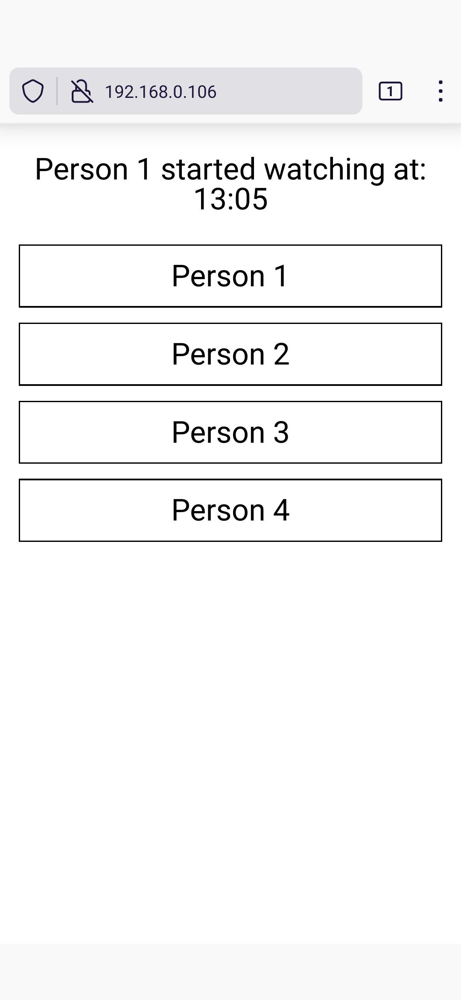

# Dog Watchers
Basic WebSocket server (Python) and client (HTML) for users to track who is watching the dog. (Mobile friendly)

To start the server, run this command (requires pipenv):
```
pipenv run python dogwatchers.py
```
or, run:
```
pip install websockets

python3 dogwatchers.py
```

